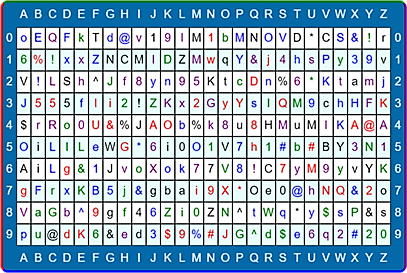

# Password Card Generator

### Secure Passwords, Easily Remembered.

Experts always recommend using passwords consisting of a long combination of letters and numbers and changing one’s passwords regularly. The problem in everyday life is that users find themselves having to remember too many different passwords. It simply becomes impossible to apply even the most basic security rules.

### Password Card

Password card enables to generate long, complex—and therefore secure—passwords very easily without the worry of remembering them.

All the user needs to do is define a single personal reading method to use each time consisting of a starting point and a reading path. The reading method is essentially a pattern enabling the user to generate as many passwords as needed. These secure passwords cannot be cracked even by the very latest hacking techniques; nor is it a problem if the user loses the card: without the personal reading method it is useless. 

Each card is unique and randomly generated.

## Generation parameters:

When generating a card it is possible to configure what will be included in your password card.

List of parameters:

* Uppercase
* Lowercase
* Numbers
* Symbols - ( !, @, #, $, %, ^, &, * )
* Color chars
* Extra color - cell border color
* Chunk length - the length of the password in which the presence of all selected types of characters is guaranteed

